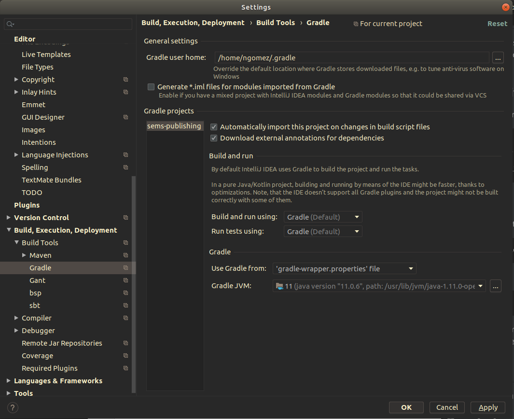

# Project Title

Flirt app, to discover people and have fun. 

## Getting Started

These instructions will get you a copy of the project up and running on your local machine for development and testing purposes.

### Prerequisites

 Need openjdk version 11.0.6
 Docker

```
Ubuntu:
apt-get install default-jdk
Mac:
brew cask install java
Other:
https://www.oracle.com/java/technologies/javase-jdk11-downloads.html
```

### Installing

Start Intellij with this project opened

Apply this setting to your  Intellij config:



```
--spring.profiles.active="receiver"
```

```
make run
```

### Running the application

## Running the tests

To be implemented

## Built With

* [Kotlin](https://kotlinlang.org/) - The programming language
* [Gradle](https://gradle.org/) - Dependency Management
* [Spring](https://spring.io/) - Framework
* [Axon](https://axoniq.io/) - Event Sourcing Framework
 

## Authors
